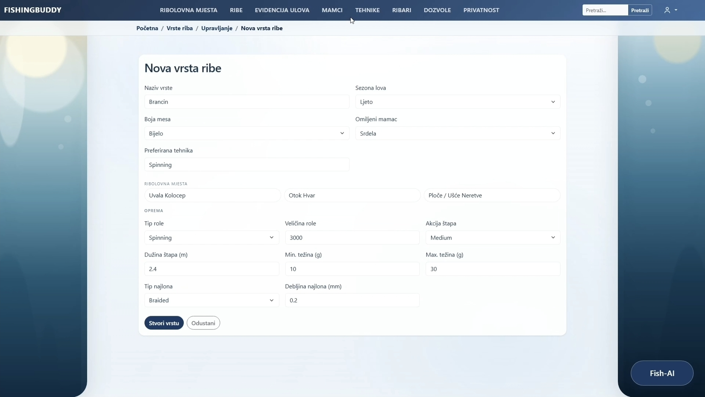
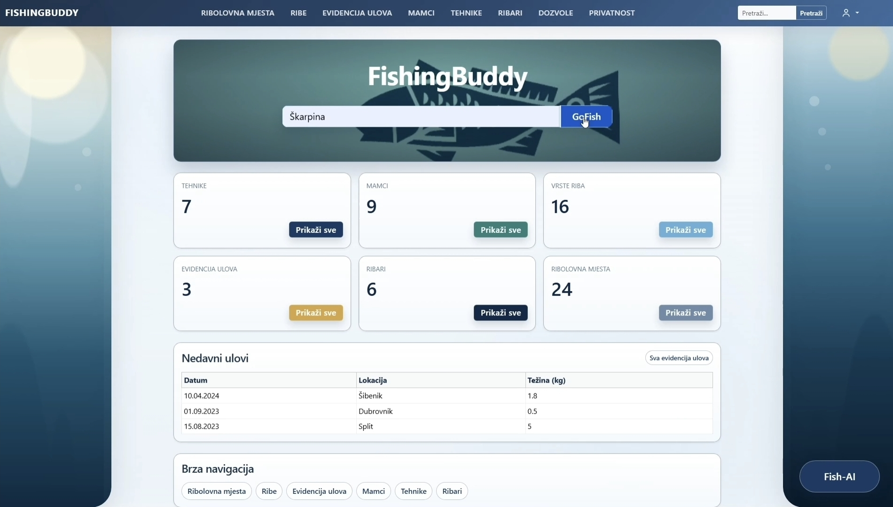
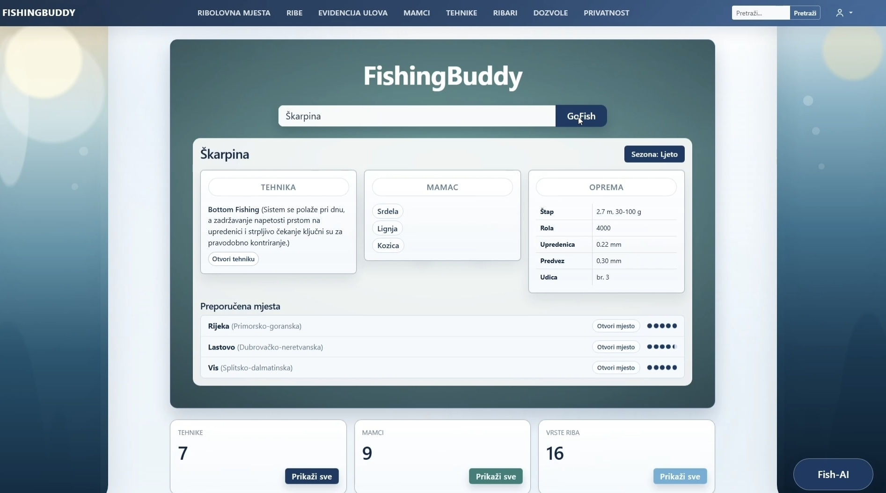
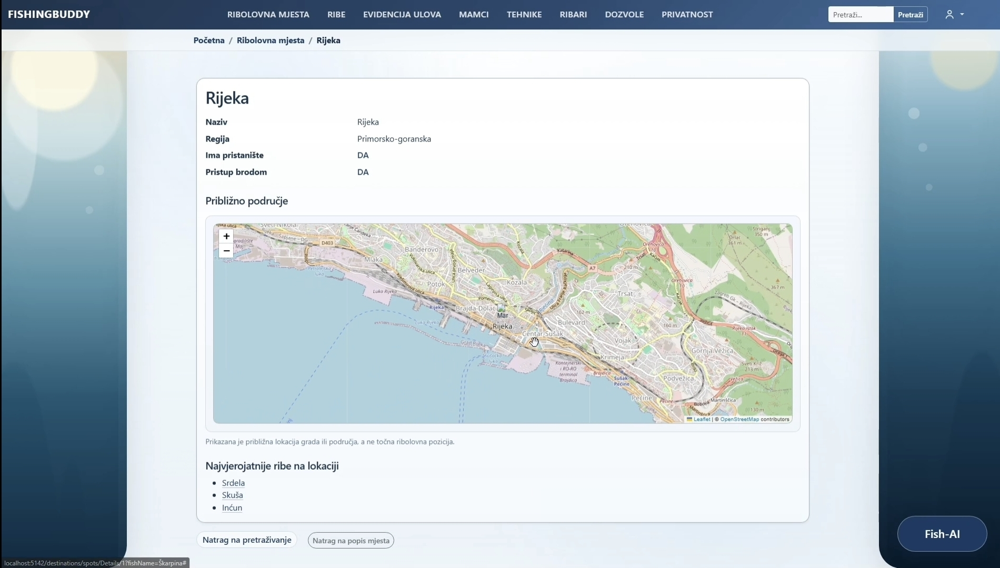
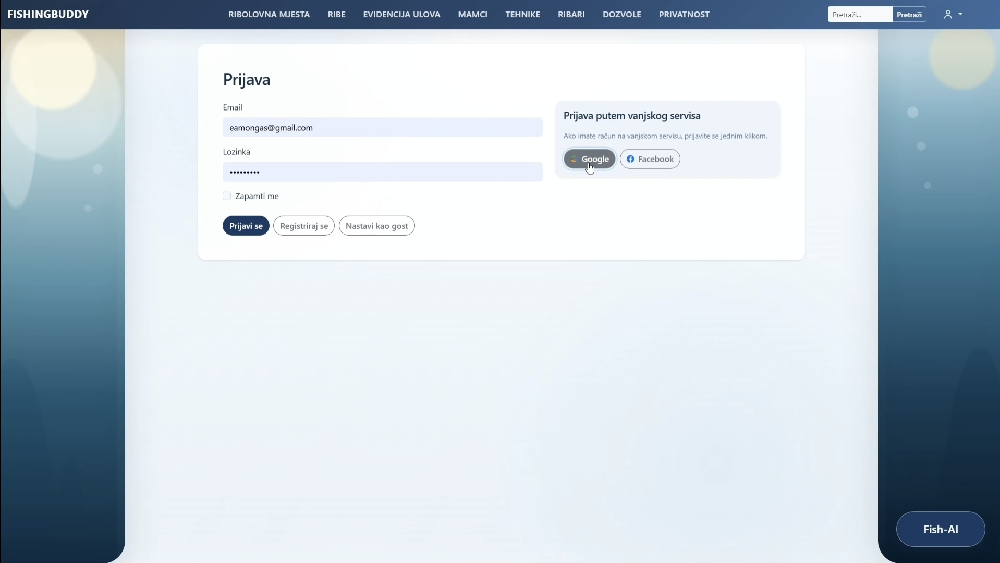

# FishingBuddy

FishingBuddy is a web application designed to provide anglers with useful fishing information and recommendations in one place.

Users can explore fish species, fishing techniques, baits and locations, keep track of their catches, and receive fishing recommendations including suitable techniques, bait, equipment and locations.

The application was developed as part of my Bachelor's degree in Computer Engineering at the Zagreb University of Applied Sciences (TVZ).

## 🎬 Demo

A short demonstration of FishingBuddy and its main features:

[▶️ Watch the FishingBuddy Demo](screenshots/demo-video.mp4)

## Features

- Search for fish species and receive fishing recommendations
- Recommended fishing techniques, bait and equipment
- Suggested fishing locations
- Interactive maps for fishing destinations
- Fish, bait, technique and location management
- Personal catch records
- User registration and authentication
- Google and Facebook authentication
- Responsive web interface
- External API integration
- AI-assisted generation of structured fish data

## Tech Stack

**Backend**
- C#
- ASP.NET Core MVC
- .NET 9
- Entity Framework Core
- ASP.NET Core Identity

**Frontend**
- Razor Views
- HTML
- CSS
- JavaScript

**Database**
- SQLite

**Other**
- REST API integration
- Git & GitHub
- Serilog
- Integration testing

## Screenshots

### AI-Assisted Fish Creation

FishingBuddy uses AI to generate structured draft data for new fish species, including biological information, fishing recommendations, equipment, bait and techniques. The generated data can be reviewed and edited before being added to the application.



### Dashboard

The main dashboard provides quick access to fishing data, recent catches and the application's search functionality.



### Fishing Recommendations

Searching for a fish species provides recommendations for fishing techniques, bait, equipment and suitable fishing locations.



### Fishing Locations

FishingBuddy provides information about fishing destinations together with an interactive map and commonly found fish species.



### Authentication

Users can sign in using a local account or supported external authentication providers.



## Architecture

FishingBuddy follows the ASP.NET Core MVC architecture with responsibilities separated across:

- **Models** – domain entities and application data
- **Views** – server-rendered user interface using Razor
- **Controllers** – request handling and application flow
- **Repositories** – data access abstraction
- **Services** – application and business logic
- **DTOs** – structured data transfer between application components

Entity Framework Core is used as the ORM layer between the application and the SQLite database.

## Getting Started

### Prerequisites

- .NET 9 SDK
- Git

### Installation

Clone the repository:

```bash
git clone https://github.com/EGAS-1812/FishingBuddy.git
```

Navigate to the project directory:

```bash
cd FishingBuddy
```

Restore dependencies:

```bash
dotnet restore
```

Run the application:

```bash
dotnet run
```

Open the local URL displayed in the terminal.

## What I Learned

Developing FishingBuddy gave me practical experience with:

- Building a complete ASP.NET Core MVC application
- Designing and working with relational data using Entity Framework Core
- Implementing authentication and user-specific functionality
- Developing server-rendered interfaces with Razor
- Using JavaScript to enhance frontend functionality
- Integrating external services and APIs
- Structuring a larger C# application into maintainable components
- Using Git and GitHub for version control

## Future Improvements

- Expand fishing recommendation functionality
- Add more detailed fishing location data
- Integrate weather and sea-condition data
- Improve the mobile user experience
- Expand automated testing
- Deploy the application to a public cloud environment

## Author

**Eamon Gaš**

Bachelor of Computer Engineering  
Zagreb University of Applied Sciences (TVZ)
